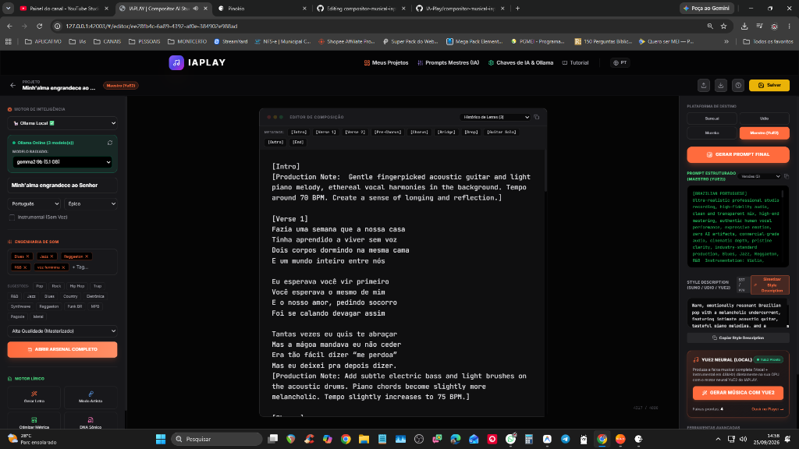
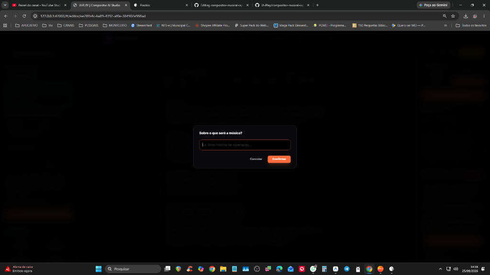
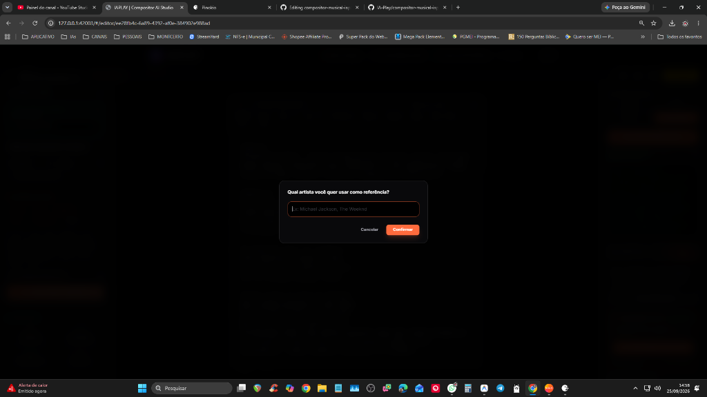
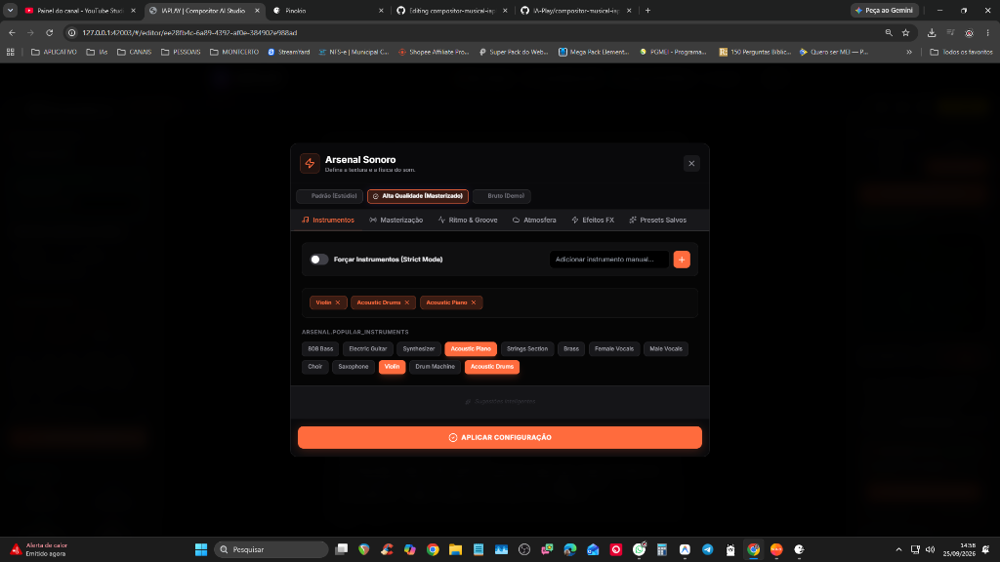
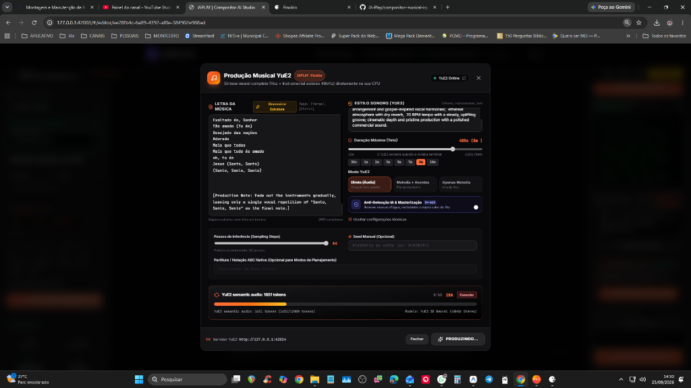
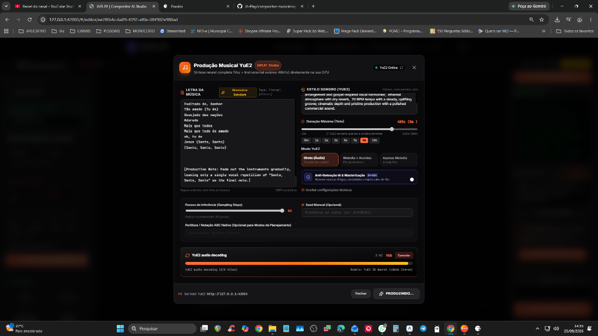
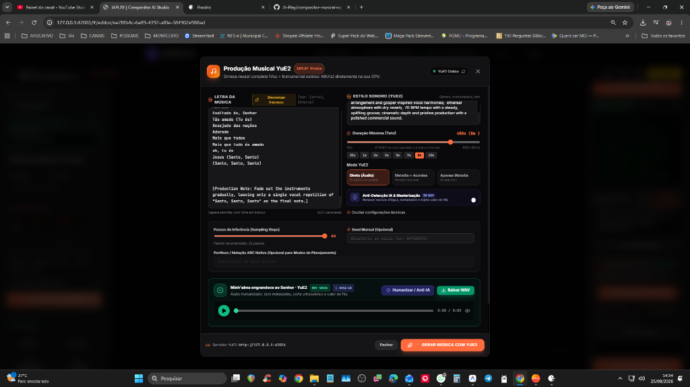

<div align="center">

# 🎵 IAPLAY Studio — Estúdio de Música & IA Neural Independente

**Composição lírica avançada, engenharia de prompts Suno/Udio/Mureka e geração musical neural local com YuE2 3B e SheetSage2.**

[](https://pinokio.computer)
[](https://github.com/IA-Play/compositor-musical-iaplay)
[](https://github.com/IA-Play/compositor-musical-iaplay)
[](https://reactjs.org/)
[](https://vitejs.dev/)
[](https://tailwindcss.com/)

[Pinokio 1-Click](#-instalação-em-1-clique-via-pinokio) • [Funcionalidades](#-principais-funcionalidades) • [Motor YuE2 Local](#-motor-neural-local-yue2--sheetsage2) • [Humanizador Anti-IA](#-sistema-anti-detecção-de-ia) • [API](#-documentação-da-api)

</div>

---

## 📖 Sobre o IAPLAY Studio

O **IAPLAY Studio** é uma estação de trabalho de áudio e inteligência artificial completa:
1. **Copiloto Lírico e de Prompts:** Gera letras estruturadas com metatags precisas (`[Verse]`, `[Chorus]`, `[Bridge]`, etc.) e prompts de estilo de alta fidelidade calibrados para Suno, Udio e Mureka.
2. **Geração Musical Neural Local (YuE2 3B):** Gera músicas completas (vocais + instrumental) em alta resolução diretamente na sua placa de vídeo (NVIDIA CUDA), de forma 100% gratuita, privada e ilimitada.
3. **Criação de Covers & Transcrição (SheetSage2):** Carregue um áudio de referência (.mp3, .wav, .m4a) para extrair harmonia e melodia guia automaticamente.
4. **Humanizador de Áudio & Anti-Detecção:** Remove artefatos de IA, normaliza dinâmica e limpa assinaturas para distribuição em plataformas.
5. **Duração Expandida:** Geração de até 10 minutos (600 segundos) de música contínua.

---

## ✨ Principais Funcionalidades

### 1. 🎛️ Motor YuE2 3B & SheetSage2 Integrado
- **Geração Local Independente:** Motor dedicado baseado em YuE2 3B Flow Matching com inferência de alta performance em Int8/BF16.
- **Modos de Geração:**
  - `Texto para Música (Prompt/Lyrics)`: Geração direta a partir de letras e descrições.
  - `Cover com Melodia + Acordes (SheetSage2)`: Transcrição neural de qualquer áudio enviado para reconstrução completa.
  - `Cover Apenas Melodia`: Mantém a linha vocal guia e permite rearmonizar o instrumental.
- **Duração Flexível até 10 Minutos:** Seleção por chips rápidos (`30s`, `1m`, `2m`, `3m`, `5m`, `7m`, `8m`, `10m`) ou detecção automática pelo tamanho do áudio carregado.

### 2. 🛡️ Sistema Anti-Detecção de IA (Áudio + Letra)
- **Ghostwriter Teoria do Caos (Lírico):** Gera letras com quebras propositais de simetria sintética, imperfeições humanas, variações de burstiness e perplexidade para contornar detectores de IA.
- **Humanizador Espectral de Áudio:** Processamento pós-geração com leve variação microtonal, saturação harmônica analógica analítica e filtragem passa-baixas sutil que atenua artefatos de vocoders neurais.

### 3. 🪄 Prompts Mestres de Elite Padronizados
- **Style Description Architect:** Sintetiza estilos em descrições ultraprecisas em inglês técnico, respeitando o limite rigoroso de até 979 caracteres para o Suno AI.
- **Rhythm Doctor & Metric Optimizer:** Corrige métricas, prosódia e flow das letras.
- **Sonic DNA Forensic Specialist:** Efetua engenharia reversa de artistas e bandas de referência.

### 4. 🧰 Arsenal de Produção & Engenharia de Prompts
- Configuração de instrumentos, mixagem, masterização, ambiências e estilos musicais populares (Pop, Rock, Trap, Funk BR, MPB, Pagode, Metal, Sertanejo, Gospel, etc.).

---

## 📸 Galeria Visual & Tour pelas Ferramentas (Screenshots)

### 🎵 1. Editor de Composição & Painel Neural Completo
*Editor lírico com metatags, controle de emoção/estilo, prompt estruturado e acionamento direto do motor neural YuE2.*


### 💡 2. Wizard de Criação: Da Ideia ao Briefing
*Transforme uma ideia simples, frase ou história em uma música estruturada com gênero e emoção ideais.*


### 🎸 3. Modo Artista & Engenharia Reversa (DNA Sônico)
*Extraia a essência técnica e o perfil vocal de qualquer artista ou banda sem violar termos de uso.*



### 🎛️ 4. Arsenal Sonoro & Textura de Áudio
*Seleção cirúrgica de instrumentos, masterização de estúdio, ritmo, groove, ambiência e efeitos analógicos.*



### 🚀 5. Centro de Comando (Dashboard de Projetos)
*Gerenciamento visual rápido de todos os seus projetos musicais, letras e histórico de versões.*


### 🧠 6. Configuração de IA Híbrida & Ollama Local (Pinokio)
*Conexão com Gemini na nuvem ou modelos 100% locais, gratuitos e privados via Ollama (Gemma 2, Llama 3).*


### ⚙️ 7. Painel Administrativo de Prompts Mestres
*Ajuste fino dos prompts mestres do sistema para personalizar a inteligência e as regras de composição do estúdio.*


---

## ⚡ Fluxo de Geração Musical Neural YuE2 3B (Direto no App)

### 1. Síntese Semântica de Áudio (Tokens YuE2 3B)
*Geração e monitoramento de tokens acústicos com contagem em tempo real e tempo decorrido.*


### 2. Decodificação Neural Acústica
*Renderização de alta fidelidade das faixas vocais e instrumentais (DiT Flow & VAE 48kHz Stereo).*


### 3. Música Pronta com Masterização Anti-IA e Player Integrado
*Áudio gerado diretamente no app, com corte de artefatos de IA, player integrado e download de WAV Master 48kHz.*



---

## ⚡ Instalação em 1-Clique via Pinokio

O IAPLAY Studio foi projetado para instalação e execução simplificada através do ecossistema [Pinokio](https://pinokio.computer):

1. Abra o **Pinokio**.
2. Clique em **Discover** ou **Download** e cole o repositório:
   ```
   https://github.com/IA-Play/compositor-musical-iaplay
   ```
3. Clique em **Instalar / Reinstalar**:
   - O Pinokio instalará as dependências do Node.js, configurará o ambiente Python virtual com PyTorch CUDA e todas as bibliotecas necessárias.
4. Clique em **Baixar Modelos YuE2**:
   - Baixa com 1 clique os pesos neurais oficiais do YuE2 3B e SheetSage2 (~6 GB) diretamente do Hugging Face para a pasta local `ckpts/`.
5. Clique em **Iniciar IAPLAY**:
   - O servidor neural do YuE2 e a interface WebUI abrirão automaticamente!

---

## 🚀 Instalação Manual (Linha de Comando)

### Pré-requisitos
- **Node.js** (v18+)
- **Python** (3.10 ou 3.11) com suporte a CUDA 12.x / 13.x
- **GPU NVIDIA** com pelo menos 8 GB VRAM recomendados

```bash
# 1. Clonar repositório
git clone https://github.com/IA-Play/compositor-musical-iaplay.git
cd compositor-musical-iaplay

# 2. Instalar dependências da WebUI
npm install
npm run build

# 3. Configurar ambiente Python
python -m venv env
.\env\Scripts\activate
pip install -r server/requirements.txt
pip install torch torchvision torchaudio --index-url https://download.pytorch.org/whl/cu124

# 4. Baixar pesos dos modelos YuE2 3B e SheetSage2
python server/download_models.py

# 5. Iniciar servidores
# Terminal 1 (Servidor YuE2):
python server/yue_server.py --port 42024 --host 127.0.0.1

# Terminal 2 (Interface Vite):
npm run dev -- --host 127.0.0.1 --port 5173
```

---

## 🔌 Documentação da API

O servidor neural do IAPLAY expõe endpoints REST na porta `42024`:

### 1. Status do Servidor e Modelos
- **GET** `/api/v1/health`
- **GET** `/api/v1/models_status`

### 2. Geração Musical
- **POST** `/api/v1/generate`

#### Exemplo em cURL:
```bash
curl -X POST http://127.0.0.1:42024/api/v1/generate \
  -H "Content-Type: application/json" \
  -d '{
    "lyrics": "[Verse]\nAcordei cedo com o sol na janela\nLembrando daquele café com ela\n\n[Chorus]\nO tempo corre e eu fico aqui\nBuscando motivos pra sorrir",
    "genre": "Acoustic Pop Rock, driving rhythm, warm acoustic guitar, emotive male vocals",
    "prompt_structure": "",
    "duration": 180,
    "humanize_anti_ai": true,
    "mode": 2
  }'
```

#### Exemplo em Python:
```python
import requests

payload = {
    "lyrics": "[Verse]\nCaminhando sob a chuva fina\n\n[Chorus]\nMinh'alma canta a melodia",
    "genre": "Modern worship ballad, melodic piano, cinematic pads, expressive lead vocal",
    "duration": 300,
    "humanize_anti_ai": True,
    "mode": 2  # 2: Text to Song, 0: Melodia + Acordes, 1: Apenas Melodia
}

response = requests.post("http://127.0.0.1:42024/api/v1/generate", json=payload)
data = response.json()
print("Job ID:", data["job_id"])
```

#### Exemplo em JavaScript:
```javascript
const res = await fetch("http://127.0.0.1:42024/api/v1/generate", {
  method: "POST",
  headers: { "Content-Type": "application/json" },
  body: JSON.stringify({
    lyrics: "[Verse]\nNoites claras de verão\n\n[Chorus]\nO som da nossa canção",
    genre: "Indie Pop, clean guitars, dreamy synths",
    duration: 120,
    humanize_anti_ai: true,
    mode: 2
  })
});
const data = await res.json();
console.log("Status da geração:", data.status, "ID:", data.job_id);
```

### 3. Upload de Áudio para Cover
- **POST** `/api/v1/upload_audio` (form-data: `file=@audio.mp3`)

---

## 📁 Estrutura do Projeto

```
compositor-musical-iaplay/
├── pinokio.js            # Menu e automações do Pinokio
├── pinokio.json          # Metadados e links do aplicativo
├── install.json          # Script de instalação do Pinokio (Node + Python + Torch)
├── start.json            # Script de inicialização do servidor e abertura da WebUI
├── download_models.json  # 1-Clique download dos pesos YuE2 3B e SheetSage2
├── update.json           # Atualizador de código e dependências
├── reset.json            # Limpeza e reset de caches
├── torch.js              # Instalador inteligente de PyTorch com aceleração CUDA
├── server/               # Servidor dedicado FastAPI do motor YuE2
│   ├── yue_server.py     # Endpoints de geração, download e transcrição
│   ├── audio_humanizer.py# Filtro espectral anti-detecção de IA
│   ├── download_models.py# Download automático do Hugging Face
│   └── requirements.txt  # Dependências Python
├── engine/               # Motor neural YuE2 3B independente (wgp)
├── src/                  # Código-fonte React / TypeScript da WebUI
├── public/               # Ícones, manifesto e arquivos estáticos
└── ckpts/                # Pesos neurais (gerenciado automaticamente)
```

---

## 📄 Licença

Distribuído sob licença MIT. Consulte `LICENSE` para mais informações.
Desenvolvido com carinho pela equipe **IA-Play**.
