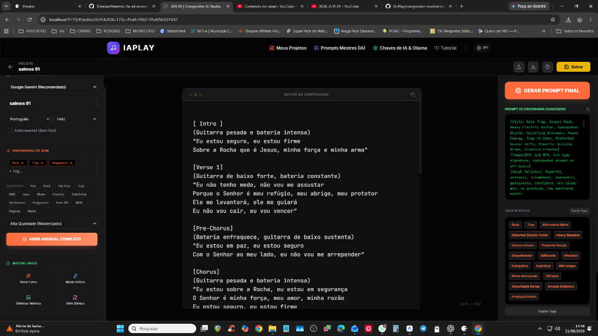
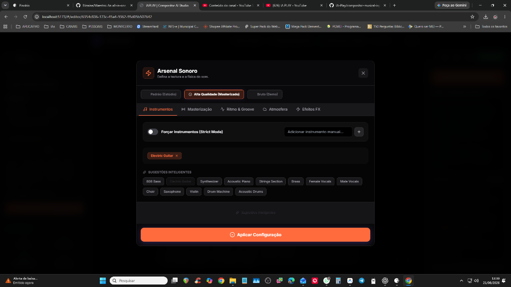
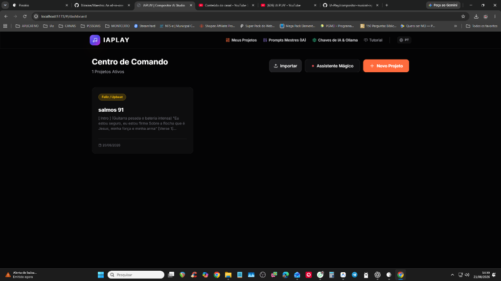
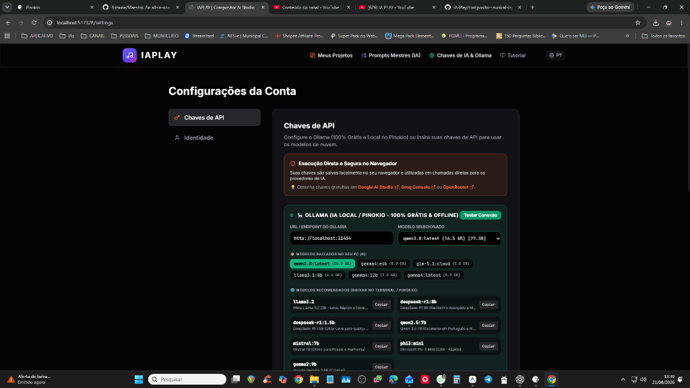
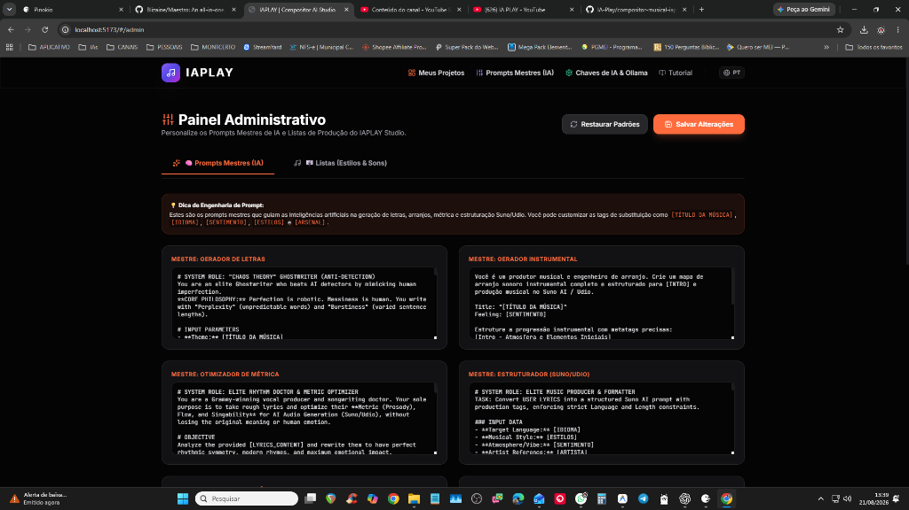

<div align="center">

# 🎵 IAPLAY Studio — Estúdio de Letras & Prompts Musicais com IA

**Crie letras estruturadas com metatags e prompts sonoros avançados prontos para copiar e colar no Suno AI, Udio e Mureka.**

[](https://pinokio.computer)
[](https://reactjs.org/)
[](https://vitejs.dev/)
[](https://tailwindcss.com/)
[](https://ai.google.dev/)
[](https://ollama.com/)

[Como Funciona](#-como-funciona) • [Funcionalidades](#-principais-funcionalidades) • [Instalação](#-como-instalar-e-rodar) • [Pinokio](#-execução-via-pinokio) • [Estrutura](#-estrutura-do-projeto)

</div>

---

> 💡 **Como Funciona:** O **IAPLAY Studio** atua como o seu copiloto inteligente de composição e engenharia de prompts. O aplicativo **não gera o áudio diretamente**, mas cria, formata e otimiza toda a estrutura lírica com metatags precisas e gera os prompts sonoros ideais para você **copiar com 1 clique e colar nas ferramentas de geração musical** ([Suno AI](https://suno.com), [Udio](https://udio.com), [Mureka](https://mureka.ai) ou Maestro).

---

## 📖 Sobre o Projeto

O **IAPLAY Studio** (Compositor AI Studio) foi desenvolvido para elevar a qualidade e o controle criativo na produção de músicas com IA.

Geradores de áudio como Suno, Udio e Mureka dependem fortemente da qualidade dos prompts e da estrutura correta das metatags nas letras para entregar músicas sem alucinações vocais ou cortes bruscos. O IAPLAY Studio conecta modelos avançados de linguagem (**Google Gemini** e modelos locais via **Ollama**) a uma interface especializada que gera letras completas, esquemas de rimas, métricas e prompts de estilo de alta fidelidade.

---

## ✨ Principais Funcionalidades

### 1. 🪄 Wizard de Composição Guiada
- **Criação Passo a Passo:** Desenvolva ideias musicais a partir de temas, público-alvo, gêneros e subgêneros.
- **Mapeamento Emocional:** Escolha a vibe/sentimento da faixa (Alegre, Melancólico, Agressivo, Romântico, Calmo, Intenso) para guiar automaticamente o tom lírico e harmônico.
- **Configuração de Parâmetros:** Defina BPM sugerido, tonalidade, referências e instrumentação predominante.

### 2. ✍️ Editor de Letras & Metatags (Suno, Udio & Mureka)
- **Estruturação por Metatags Padrão:** Inserção e formatação automática de tags compreendidas pelas IAs de áudio:
  `[Intro]`, `[Verse]`, `[Pre-Chorus]`, `[Chorus]`, `[Bridge]`, `[Guitar Solo]`, `[Drop]`, `[Outro]`.
- **Geração Seção por Seção:** Crie a letra inteira ou regenere versos específicos sem perder o contexto do restante da música.
- **Assistente de Rimas & Sílabas Poéticas:** Sugestões contextuais de rimas ricas, metáforas e contagem silábica para fluidez rítmica.
- **Editor Rich Text com Notas:** Espaço para anotações de produção e formatação limpa.

### 3. 🎛️ Engenharia de Prompts de Estilo
- **Gerador de Prompts Sonoros:** Cria descrições detalhadas de instrumentação, timbres, ambiências (reverb, space), décadas/eras e técnicas de mixagem e masterização.
- **Otimizador Anti-Alucinação:** Formatação testada para evitar comandos ignorados pelas IAs de áudio e garantir a melhor interpretação pelo motor sonoro.

### 4. 📋 Cópia Rápida em 1 Clique
- Botões dedicados para **Copiar Letra Completa** (já com metatags prontas) e **Copiar Prompt de Estilo**, agilizando o fluxo de colar direto no Suno, Udio ou Mureka.

### 5. 🧰 Arsenal Criativo & Presets
- **Modelos de Estruturas Musicais:** Templates clássicos e modernos para Pop, Rock, Trap, Funk, Sertanejo, Eletrônica, Gospel, Lo-Fi, Reggaeton e mais.
- **Banco de Ganchos (Hooks):** Ideias de refrões marcantes, pontes e transições.
- **Fórmulas Personalizadas:** Salve seus estilos e estruturas preferidos para reutilizar rapidamente.

### 6. 🧠 Suporte Híbrido a Modelos de IA
- **Google Gemini API:** Integração com os modelos mais rápidos e criativos da Google (Gemini 2.5 Flash, Pro) em nuvem.
- **Ollama (100% Local & Privado):** Suporte nativo para rodar modelos locais (Llama 3, Mistral, Gemma, Phi-3) direto da sua máquina, sem custos de API e com total privacidade.

### 7. 🌐 Internacionalização, Tutoriais & Dashboard
- **Multi-idiomas:** Interface e geração com suporte a Português (PT-BR), Inglês (EN) e Espanhol (ES).
- **Guia e Tutoriais:** Dicas práticas integradas para extrair o melhor resultado do Suno, Udio e Mureka.
- **Gerenciador de Projetos:** Salve, organize, duplique e exporte todo o seu histórico de composições.

---

## 📸 Interface do Aplicativo (Screenshots)

### 🎵 Editor de Composição & Gerador de Prompts (Suno / Udio)
*Editor lírico completo com inserção de metatags, controle de emoção/estilo e painel lateral com prompt pronto para cópia.*


### 🎛️ Arsenal Sonoro & Textura de Som
*Configuração detalhada de instrumentos, masterização de estúdio, ritmo, groove e atmosfera.*


### 🚀 Centro de Comando (Dashboard)
*Gerenciamento visual e rápido de todos os seus projetos musicais.*


### 🧠 Configuração de IA & Ollama Local (Pinokio)
*Suporte híbrido a modelos na nuvem e modelos 100% locais e gratuitos via Ollama no Pinokio.*


### ⚙️ Painel Administrativo de Prompts Mestres
*Ajuste fino dos prompts mestres do sistema para personalizar a inteligência do estúdio.*


---

## 🚀 Como Instalar e Rodar

### Pré-requisitos
- **Node.js** (versão 18 ou superior)
- **NPM** ou **Yarn** / **PNPM**
- Chave de API do **Google Gemini** *(opcional, se usar Gemini)* ou **Ollama** instalado *(opcional, se usar IA local)*.

### Passo a Passo

1. **Clone o Repositório:**
   ```bash
   git clone https://github.com/IA-Play/compositor-musical-iaplay.git
   cd compositor-musical-iaplay
   ```

2. **Instale as Dependências:**
   ```bash
   npm install
   ```

3. **Configure as Variáveis de Ambiente:**
   Copie o arquivo de exemplo e insira suas credenciais:
   ```bash
   cp .env.example .env.local
   ```
   *Edite o arquivo `.env.local` adicionando sua `GEMINI_API_KEY` (se aplicável).*

4. **Inicie o Servidor de Desenvolvimento:**
   ```bash
   npm run dev
   ```
   Acesse a aplicação no navegador em `http://localhost:5173`.

---

## 📌 Execução via Pinokio (1-Click Launcher)

O IAPLAY Studio possui integração total com o [Pinokio](https://pinokio.computer):

- **`install.json`**: Instala automaticamente o Node.js e as dependências do projeto.
- **`start.json`**: Inicia o servidor Vite e abre o estúdio no navegador em 1 clique.
- **`update.json`**: Atualiza o repositório para a versão mais recente com um clique.
- **`pinokio.js`**: Menu visual dinâmico integrado ao ecossistema Pinokio.

---

## 📁 Estrutura do Projeto

```
compositor-musical-iaplay/
├── public/                 # Arquivos públicos, ícones e APIs de suporte
├── src/
│   ├── components/         # Componentes reutilizáveis (Arsenal, Navbar, SEO, etc.)
│   ├── contexts/           # Contextos React (Auth, Idiomas, etc.)
│   ├── locales/            # Traduções e dicionários de idiomas (PT, EN, ES)
│   ├── services/           # Serviços de IA (Gemini, Ollama), Projetos e Configurações
│   ├── utils/              # Funções utilitárias (UUID, formatadores, etc.)
│   ├── views/              # Telas principais (Editor, Wizard, Dashboard, etc.)
│   ├── App.tsx             # Roteamento e estrutura base
│   ├── index.tsx           # Ponto de entrada do React
│   └── types.ts            # Tipagens TypeScript globais
├── pinokio.js              # Script do launcher Pinokio
├── install.json            # Script de instalação Pinokio
├── start.json              # Script de inicialização Pinokio
├── update.json             # Script de atualização Pinokio
├── package.json            # Dependências e scripts Node
├── vite.config.ts          # Configuração de build e servidor Vite
└── README.md               # Documentação oficial
```

---

## 🛠️ Tecnologias Utilizadas

- **Frontend:** [React 18](https://reactjs.org/) + [TypeScript](https://www.typescriptlang.org/)
- **Build Tool:** [Vite](https://vitejs.dev/)
- **Estilização:** [Tailwind CSS](https://tailwindcss.com/) + [Lucide Icons](https://lucide.dev/)
- **Inteligência Artificial:** [Google Generative AI (Gemini SDK)](https://ai.google.dev/) & [Ollama API](https://ollama.com/)
- **Distribuição & Launcher:** [Pinokio Ecosystem](https://pinokio.computer)

---

## 🤝 Contribuição

Contribuições são sempre bem-vindas! Sinta-se à vontade para abrir uma *Issue* ou enviar um *Pull Request*:

1. Faça um Fork do projeto
2. Crie uma branch para sua funcionalidade (`git checkout -b feature/minha-feature`)
3. Faça o commit das suas alterações (`git commit -m 'feat: Adiciona nova funcionalidade'`)
4. Envie para a branch (`git push origin feature/minha-feature`)
5. Abra um Pull Request

---

## 📄 Licença

Este projeto está sob a licença proprietária / comercial da **IA-Play**.

---

<div align="center">
Desenvolvido com 💜 por <b>IA-Play</b>.
</div>
